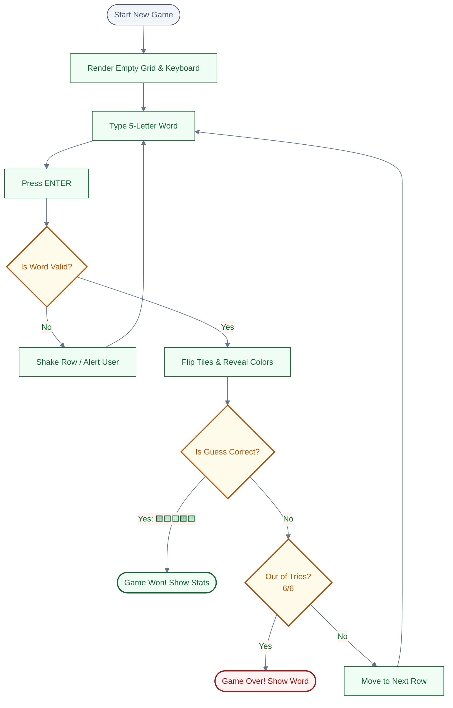

# Wordle-ish


**Wordle-ish** is a Wordle-style word-guessing game, built as a Chingu Voyage 61 (Tier 3, Team 99) collaborative project.

---

## Key Features

- **On-screen virtual keyboard** that updates key states (correct, misplaced, wrong) in real time, matching the board's tile feedback.
- **Sign in with GitHub** and a **leaderboard** tracking games played/won per player, backed by Supabase.
- **Infinity Mode word length options** — 5-letter (default) or 6-letter words; Live Challenge (Hourly) and Daily stay 5-letter-only.

---

## Tech Stack

| Layer                   | Technology                              | Notes                                                                 |
| :---------------------- | :--------------------------------------- | :--------------------------------------------------------------------- |
| **Frontend**            | React 19, Vite, Tailwind CSS, React Router | Word game UI and routing                                              |
| **Auth + Leaderboard + Words + Stats** | Supabase (Postgres, Auth, Row Level Security) | GitHub OAuth sign-in, `leaderboard` table + RPC, word selection via `get_random_word`/`get_hourly_word`/`get_daily_word` RPCs (5- and 6-letter answer pools), per-user `game_history`, and anonymous guest stats via the `player_stats` table + `record_player_stat`/`get_player_stats` RPCs (see `supabase/migrations/`) |
| **Legacy backend (word API)** | Node.js / Express + PostgreSQL      | Standalone `GET /api/word/random` / `GET /api/word/hourly` server (`backend/node/`). No longer called by the frontend in any environment — superseded by the Supabase RPCs above so word selection works without a separately hosted service. Kept around for local experimentation; not required for anything. |
| **CI**                  | GitHub Actions                           | Lint + build checks on frontend PRs (`.github/workflows/`)             |
| **AI Code Review**      | Gemini Code Assist                       | Automated review comments on PRs                                      |

---

## Quick Start

1.  **Clone & Enter:**

    ```bash
    git clone https://github.com/chingu-voyages/V61-tier3-team-99 && cd V61-tier3-team-99
    ```

2.  **Run the frontend (development):**

    ```bash
    cd frontend
    cp .env.example .env
    npm ci
    npm run dev
    ```

    Word selection (both Infinity Mode and the Live Challenge) goes through
    Supabase — see step 4. Without Supabase configured, Infinity Mode falls
    back to a client-side word list automatically, but Live Challenge has no
    fallback (a client-generated word would break the "same word for
    everyone" guarantee), so it needs Supabase set up to work at all.

<!--
Step 3 (legacy Express backend) is commented out, not deleted: word
selection and stats now run entirely through Supabase (step 4) and this
predates that migration, so it's no longer part of the setup path anyone
needs to follow. Left here in case we wire in a dedicated backend again
later (e.g. a Python service) — the Docker/Postgres/seed steps below still
work against `backend/node/` if uncommented. Renumber if reactivated.

3.  **Run the legacy Express backend (optional, not required):**

    This predates the Supabase word RPCs and is no longer called by the
    frontend in any environment. Only useful if you're experimenting with it
    directly. Requires PostgreSQL — either a local install, or via Docker:

    ```bash
    docker run --name matrixword-pg -e POSTGRES_PASSWORD=postgres -p 5432:5432 -d postgres:17
    docker exec matrixword-pg createdb -U postgres matrixword
    ```

    Then set up and start the server:

    ```bash
    cd backend/node
    cp .env.example .env   # adjust DATABASE_URL if your Postgres differs
    npm ci
    npm run db:seed        # creates the words table and loads the word lists (idempotent)
    npm run dev
    ```

    - Frontend: `http://localhost:5173`
    - Backend API: `http://localhost:5001` (try `/api/health` and `/api/word/random?length=5` — port 5000 is avoided because macOS AirPlay Receiver occupies it)
    - Postgres: `localhost:5432`
-->

4.  **Set up Supabase (word selection + leaderboard + stats + "Sign in with GitHub"):**

    The hosted app (production and preview deployments) already runs against one shared Supabase project — if you're just testing a preview link or the deployed app, **you can skip this step entirely**. It's only needed if you want to run the frontend locally against your own separate Supabase project (e.g. for local development on these features, or if you're forking this repo).

    - Create a project at [supabase.com](https://supabase.com).
    - In the dashboard, go to **Authentication → Providers → GitHub** and enable it. This requires a GitHub OAuth App (GitHub → Settings → Developer settings → OAuth Apps) with its **Authorization callback URL** set to the callback URL shown on that Supabase provider page (`https://<project-ref>.supabase.co/auth/v1/callback`). Paste the OAuth App's Client ID/Secret into Supabase.
    - In **Settings → API**, copy the Project URL and the **publishable key** (`sb_publishable_...` — the current replacement for the legacy anon key; never use the secret key here).
    - In the SQL Editor, run each file in [`supabase/migrations/`](supabase/migrations/) once, in order:
      - `0001_leaderboard.sql` — `leaderboard` table + RPC
      - `0002_words.sql` — `words` table (seeded with the answer list) + `get_random_word`/`get_hourly_word` RPCs
      - `0003_player_stats.sql` — `player_stats` table + `record_player_stat`/`get_player_stats` RPCs
      - `0004_global_game_stats.sql` — `get_global_game_stats` RPC (anonymized landing-page stats)
      - `0005_game_history.sql` — `game_history` table (per-user past games)
      - `0006_daily_word.sql` — `get_daily_word` RPC (Daily mode)
      - `0007_daily_puzzle_stats.sql` — `get_daily_puzzle_stats` RPC (today's-puzzle stats for authenticated players)
      - `0008_daily_puzzle_guest_stats.sql` — `daily_puzzle_results` table + guest equivalent of the above
      - `0009_fix_daily_word_edge_cases.sql` / `0010_fix_daily_word_offset_range_and_index.sql` — bug fixes to `get_daily_word`
      - `0012_six_letter_words.sql` — seeds 6-letter answer words for Infinity Mode (no RPC changes needed; `get_random_word`/`get_hourly_word`/`get_daily_word` already filter generically on length)
    - In `frontend/`, copy `.env.example` to `.env.local` and fill in:

      ```env
      VITE_SUPABASE_URL=https://your-project-ref.supabase.co
      VITE_SUPABASE_PUBLISHABLE_KEY=sb_publishable_your_key
      ```

    Without these set, Infinity Mode still works via its client-side word-list fallback, but sign-in, the leaderboard, game history, and the Daily and Live Challenge (Hourly) modes are all unavailable.

---

## System Architecture

The basic architectural workflow is as follows:



---

## Meet the Team

| Name                        | Role          | Links                                                                                               |
| :-------------------------- | :------------ | :-------------------------------------------------------------------------------------------------- |
| **Alex Thomas**             | Scrum Master  | [GitHub](https://github.com/BagelTime) / [LinkedIn](https://linkedin.com/in/ajt11176)               |
| **Dustin Hoeppner**         | Web Developer | [GitHub](https://github.com/dhoepp) / [LinkedIn](https://linkedin.com/in/dustin-hoeppner)           |
| **John Omokhagbon Ezekiel** | Web Developer | [GitHub](https://github.com/Sirius1616) / [LinkedIn](https://www.linkedin.com/in/john-ezekiel-dev/) |
| **Lindsay Allen**           | Web Developer | [GitHub](https://github.com/lkallen) / [LinkedIn](https://www.linkedin.com/in/lindsay-allen-dev/)   |
| **Pratyusha Dasari**        | Web Developer | [GitHub](https://github.com/pratyusha-ds) / [LinkedIn](https://www.linkedin.com/in/pratyusha-ds/)   |
